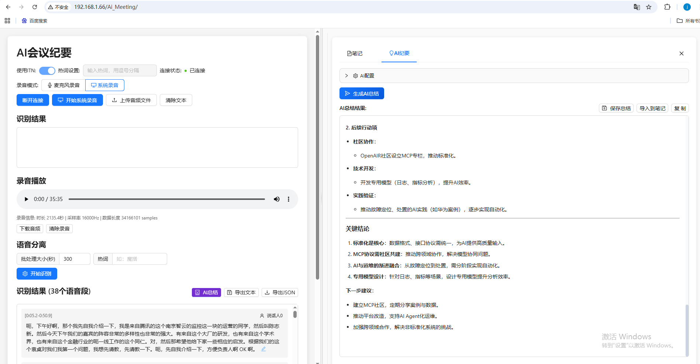
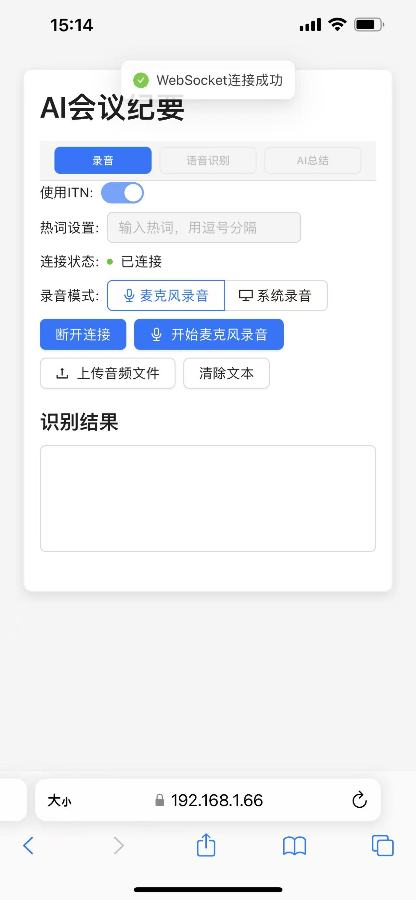

# 🎙️ AI会议纪要系统 (Meeting ASR System)

<div align="center">

[](https://opensource.org/licenses/MIT)
[](https://www.python.org/downloads/)
[](https://reactjs.org/)
[](https://www.typescriptlang.org/)
[](https://github.com/alibaba-damo-academy/FunASR)

**一个基于 FunASR 的实时语音识别系统，支持在线/离线语音转文字，专为会议场景设计**

[功能特性](#-功能特性) • [快速开始](#-快速开始) • [使用方法](#-使用方法) • [API文档](#-api文档) • [贡献指南](#-贡献指南)

</div>

---

## 📋 目录

- [功能特性](#-功能特性)
- [演示效果](#-演示效果)
- [系统架构](#️-系统架构)
- [技术栈](#-技术栈)
- [快速开始](#-快速开始)
- [使用方法](#-使用方法)
- [项目结构](#-项目结构)
- [配置说明](#️-配置说明)
- [性能指标](#-性能指标)
- [故障排除](#-故障排除)
- [API文档](#-api文档)
- [贡献指南](#-贡献指南)
- [许可证](#-许可证)
- [联系方式](#-联系方式)

## 🚀 功能特性

### 🎯 核心功能
- **🔄 实时语音识别**: 支持在线流式识别和离线批量识别
- **🎛️ 多种识别模式**: 
  - `online`: 在线流式识别，低延迟 (~200ms)
  - `offline`: 离线批量识别，高精度 (>95%)
  - `2pass`: 两遍识别，兼顾速度和精度
- **🎤 语音活动检测 (VAD)**: 自动检测语音段落，过滤静音
- **📝 标点符号预测**: 自动添加标点符号，提升可读性
- **👥 说话人识别**: 自动区分不同说话人，支持多人会议场景
- **🔥 热词支持**: 支持自定义热词提升识别准确率
- **📁 文件上传识别**: 支持音频文件批量处理
- **🌐 WebSocket 通信**: 实时双向通信，低延迟传输
- **🔒 SSL/TLS 支持**: 支持安全连接 (WSS)，保障数据安全
- **💻 现代化 UI**: 基于 React + TypeScript + Ant Design

### 🎯 使用场景
- **📊 会议记录**: 实时转录会议内容，自动生成会议纪要
- **🎓 在线教育**: 课程录音转文字，便于学习回顾
- **📞 客服质检**: 通话录音批量转录，质量分析
- **🎙️ 播客制作**: 音频内容转文字，便于编辑和SEO
- **♿ 无障碍服务**: 为听障人士提供实时字幕服务

## 📸 演示效果

### 💻 桌面端界面


*桌面端功能完整，支持实时语音识别、文件上传、AI总结等功能*

### 📱 移动端界面  


*移动端完美适配，响应式设计，支持触屏操作*


*实时语音识别演示 - 从说话到文字显示的完整流程*


### 🌟 界面特色
- **🎨 现代化设计**: 简洁美观的用户界面
- **📱 响应式布局**: 完美适配桌面端和移动端
- **🌙 深色模式**: 支持浅色/深色主题切换 (规划中)
- **🎯 直观操作**: 一键连接、实时反馈
- **📊 智能总结**: AI自动生成会议纪要和关键信息

### 实时语音识别界面
```
┌─────────────────────────────────────────────────────────────┐
│  🎙️ 会议语音识别系统                                        │
├─────────────────────────────────────────────────────────────┤
│  服务器: wss://192.168.1.66:10095  [🟢 已连接]             │
│  模式: online  热词: 人工智能,机器学习                       │
├─────────────────────────────────────────────────────────────┤
│  [🔴 录音中...] [⏹️ 停止] [📁 文件模式]                     │
├─────────────────────────────────────────────────────────────┤
│  识别结果:                                                   │
│  大家好，今天我们来讨论人工智能在语音识别领域的应用。        │
│  通过深度学习技术，我们可以实现高精度的语音转文字功能。      │
└─────────────────────────────────────────────────────────────┘
```

### 支持的音频格式
- **输入格式**: WAV, MP3, AAC, FLAC, M4A, OGG
- **采样率**: 8kHz, 16kHz, 44.1kHz, 48kHz
- **声道**: 单声道/立体声
- **位深**: 16bit, 24bit, 32bit

## 🏗️ 系统架构

```
┌─────────────────┐    WebSocket     ┌─────────────────┐
│   React 前端    │ ◄──────────────► │ WSS 实时服务    │
│                 │                  │ (meet_wss_server)│
│ • 音频录制      │                  │ • 实时识别      │
│ • 实时显示      │                  │ • VAD 检测      │
│ • 文件上传      │                  │ • 标点预测      │
└─────────────────┘                  └─────────────────┘
         │                                    │
         │ HTTP API                           │ 模型共享
         ▼                                    ▼
┌─────────────────┐                  ┌─────────────────┐
│ API 识别服务    │                  │   AI 模型库     │
│(meeting_api_server)                │                 │
│ • 文件识别      │                  │ • Paraformer    │
│ • 说话人识别    │                  │ • FSMN-VAD      │
│ • 批量处理      │                  │ • CT-Transformer│
└─────────────────┘                  │ • CAMPPlus      │
                                     └─────────────────┘
```

## 📦 技术栈

### 前端
- **React 19** + **TypeScript**
- **Vite** - 构建工具
- **Ant Design** - UI 组件库
- **WebSocket API** - 实时通信

### 后端
- **Python** + **asyncio**
- **FunASR** - 阿里达摩院语音识别框架
- **WebSockets** - 实时通信服务
- **PyTorch** - 深度学习框架

### AI 模型
- **Paraformer**: 语音识别主模型 (支持中英文混合识别)
- **FSMN-VAD**: 语音活动检测 (自动分割语音段)
- **CT-Transformer**: 标点符号预测 (智能添加标点)
- **CAMPPlus**: 说话人识别 (区分不同说话人，支持多人会议)

## 🛠️ 快速开始

### 📋 环境要求
- **Python**: 3.8+ (推荐 3.9+)
- **Node.js**: 16+ (推荐 18+)
- **内存**: 最少 4GB RAM (推荐 8GB+)
- **存储**: 至少 10GB 可用空间 (用于模型存储)
- **CUDA**: 可选，用于 GPU 加速 (推荐 CUDA 11.8+)

### ⚡ 一键部署

```bash
# 1. 克隆项目
git clone https://github.com/your-username/Meeting-ASR-System.git
cd Meeting-ASR-System

# 2. 后端部署
cd websocket
pip install -r requirements.txt
pip install -U modelscope funasr

# 3. 启动后端服务 (模型会自动下载)
python funasr_wss_server.py --port 10095

# 4. 前端部署 (新终端)
cd ../react-ts-asr
npm install
npm run dev
```

### 🚀 Docker 部署 (推荐)

```bash
# 构建并启动服务
docker-compose up -d

# 查看服务状态
docker-compose ps
```

### 🔧 详细安装步骤

#### 后端服务部署

本项目包含两个后端服务，分别提供不同的功能：

##### 🔄 WebSocket 实时识别服务 (WSS)

```bash
cd websocket

# 安装Python依赖
pip install -r requirements.txt
pip install -U modelscope funasr

# 启动WSS服务 (实时语音识别)
python meet_wss_server.py --port 10095

# 生产环境启动 (使用SSL)
python meet_wss_server.py --port 10095 \
  --certfile ../ssl_key/server.crt \
  --keyfile ../ssl_key/server.key

# GPU加速启动
python meet_wss_server.py --port 10095 --ngpu 1 --device cuda

# 自定义模型路径
python meet_wss_server.py --port 10095 \
  --asr_model ./models/speech_paraformer-large-vad-punc_asr_nat-zh-cn-16k-common-vocab8404-pytorch \
  --vad_model ./models/speech_fsmn_vad_zh-cn-16k-common-pytorch \
  --punc_model ./models/punc_ct-transformer_zh-cn-common-vad_realtime-vocab272727
```

##### 🎤 HTTP API 识别服务 (含说话人识别)

```bash
# 启动API服务 (文件上传识别 + 说话人识别)
python meeting_api_server.py

# 自定义端口启动
uvicorn meeting_api_server:app --host 0.0.0.0 --port 8000

# 生产环境启动
uvicorn meeting_api_server:app --host 0.0.0.0 --port 8000 --workers 4
```

##### 📋 服务功能对比

| 服务类型 | 端口 | 主要功能 | 使用场景 |
|---------|------|----------|----------|
| **WSS服务** | 10095 | 实时语音识别、VAD检测 | 实时录音转文字 |
| **API服务** | 8000 | 文件识别、说话人识别 | 音频文件批量处理 |

##### 🚀 同时启动两个服务

```bash
# 终端1: 启动WSS服务
python meet_wss_server.py --port 10095

# 终端2: 启动API服务  
python meeting_api_server.py

# 或使用PM2管理进程
pm2 start meet_wss_server.py --name "wss-server" -- --port 10095
pm2 start meeting_api_server.py --name "api-server"
```

#### 前端应用部署

```bash
cd react-ts-asr

# 安装依赖
npm install

# 开发模式启动
npm run dev

# 生产构建
npm run build
npm run preview

# 使用PM2部署 (推荐生产环境)
npm install -g pm2
npm run build
pm2 serve dist 3000 --name "meeting-asr-frontend"
```

## 📊 性能指标

### 🎯 识别精度
- **中文普通话**: >95% (清晰语音)
- **英文**: >90% (标准发音)
- **方言支持**: 部分支持 (准确率会有所下降)
- **噪音环境**: >85% (轻度噪音)

### ⚡ 响应速度
- **在线模式延迟**: ~200ms
- **离线模式处理**: ~0.5x 实时率
- **VAD检测延迟**: <100ms
- **WebSocket连接**: <50ms

### 💾 资源占用
- **CPU模式**: 2-4GB RAM
- **GPU模式**: 4-8GB VRAM + 2GB RAM
- **模型大小**: ~3GB (全套模型)
- **网络带宽**: 64kbps (音频流)

### 🔧 系统兼容性
- **操作系统**: Windows 10+, macOS 10.15+, Ubuntu 18.04+
- **浏览器**: Chrome 80+, Firefox 75+, Safari 13+, Edge 80+
- **移动端**: iOS 13+, Android 8+
- **Python版本**: 3.8, 3.9, 3.10, 3.11

## 🎯 使用方法

### 🎤 实时语音识别
1. **连接服务器**
   - 打开前端应用 (默认: http://localhost:5173)
   - 配置服务器地址 (默认: `wss://192.168.1.66:10095/`)
   - 点击"连接服务器"按钮

2. **配置识别参数**
   - 选择识别模式 (`online`/`offline`/`2pass`)
   - 设置热词 (可选): `人工智能,机器学习,深度学习`
   - 调整其他参数 (ITN、批处理大小等)

3. **开始识别**
   - 点击"开始录音"按钮
   - 对着麦克风说话
   - 实时查看识别结果
   - 点击"停止录音"结束

### 📁 文件批量识别 (含说话人识别)
1. **切换到文件模式**
   - 点击界面上的"文件模式"选项卡

2. **上传音频文件**
   - 支持格式: WAV, MP3, AAC, FLAC, M4A, OGG
   - 单文件最大: 100MB
   - 批量上传: 最多10个文件

3. **配置处理参数**
   - 批处理时长: 15000ms (推荐)
   - 热词设置: 根据音频内容添加
   - 说话人识别: 自动启用 (多人会议场景)
   - 输出格式: 纯文本/带时间戳/带说话人标签

4. **开始处理**
   - 点击"开始识别"
   - 等待处理完成 (包含说话人分离)
   - 查看识别结果 (自动标注说话人)
   - 下载识别结果 (TXT/JSON格式)

### 👥 说话人识别功能
1. **自动说话人检测**
   - 系统自动识别音频中的不同说话人
   - 为每个说话人分配标签 (如: spk0, spk1, spk2...)
   - 支持最多10个说话人的同时识别

2. **说话人标签管理**
   - 点击说话人标签可进行重命名
   - 支持替换为真实姓名 (如: 张三, 李四)
   - 批量替换相同说话人的所有标签

3. **识别结果格式**
   ```
   [spk0]: 大家好，今天我们来讨论项目进展。
   [spk1]: 好的，我先汇报一下技术方面的情况。
   [spk0]: 请继续，我们都在听。
   [spk2]: 我补充一下市场方面的数据。
   ```

### ⚙️ 高级配置
- **🔥 热词设置**: 在热词输入框中添加专业术语，用逗号分隔
  ```
  示例: 人工智能,机器学习,深度学习,神经网络,自然语言处理
  ```
- **🔄 ITN 开关**: 控制是否进行逆文本标准化 (数字、日期格式化)
- **📦 批处理大小**: 调整文件识别的批处理时长 (5000-30000ms)
- **🎚️ 音频增强**: 自动降噪、音量标准化 (实验性功能)

## 📁 项目结构

```
Meeting/
├── react-ts-asr/              # React 前端应用
│   ├── src/
│   │   ├── components/         # React 组件
│   │   ├── services/          # WebSocket 服务
│   │   ├── utils/             # 工具函数
│   │   └── styles/            # 样式文件
│   └── package.json
├── websocket/                  # Python 后端服务
│   ├── funasr_wss_server.py   # WebSocket 服务器
│   ├── funasr_api_server.py   # HTTP API 服务器
│   └── requirements_server.txt
├── models/                     # AI 模型目录
│   ├── speech_paraformer-large-vad-punc_asr_nat-zh-cn/
│   ├── speech_fsmn_vad_zh-cn-16k-common-pytorch/
│   └── punc_ct-transformer_zh-cn-common-vad_realtime-vocab272727/
├── ssl_key/                    # SSL 证书
│   ├── server.crt
│   └── server.key
└── test/                       # 测试文件
    └── 1112.wav
```

## 📚 API文档

### WebSocket API

#### 连接端点
```
ws://localhost:10095/    # HTTP
wss://localhost:10095/   # HTTPS (推荐)
```

#### 消息格式

**发送消息 (客户端 → 服务器)**
```json
{
  "mode": "online",           // 识别模式: online/offline/2pass
  "chunk_size": [5, 10, 5],  // 流式识别参数
  "chunk_interval": 10,       // 块间隔 (ms)
  "wav_name": "microphone",   // 音频源名称
  "is_speaking": true,        // 是否正在说话
  "hotwords": "人工智能,机器学习", // 热词 (可选)
  "itn": true,               // 是否启用ITN
  "wav_format": "pcm",       // 音频格式
  "audio_data": "base64..."  // 音频数据 (Base64编码)
}
```

**接收消息 (服务器 → 客户端)**
```json
{
  "mode": "online",
  "wav_name": "microphone", 
  "text": "识别结果文本",
  "is_final": false,        // 是否为最终结果
  "timestamp": 1640995200,  // 时间戳
  "confidence": 0.95,       // 置信度
  "words": [                // 词级别信息 (可选)
    {
      "word": "人工智能",
      "start_time": 1.2,
      "end_time": 2.1,
      "confidence": 0.98
    }
  ]
}
```

### HTTP API (实验性)

#### 文件上传识别
```bash
curl -X POST http://localhost:8000/upload \
  -F "file=@audio.wav" \
  -F "mode=offline" \
  -F "hotwords=人工智能,机器学习"
```

#### 健康检查
```bash
curl http://localhost:10095/health
```

### SDK 示例

#### JavaScript/TypeScript
```typescript
class ASRClient {
  private ws: WebSocket;
  
  connect(url: string) {
    this.ws = new WebSocket(url);
    this.ws.onmessage = (event) => {
      const result = JSON.parse(event.data);
      console.log('识别结果:', result.text);
    };
  }
  
  sendAudio(audioData: ArrayBuffer) {
    const message = {
      mode: 'online',
      audio_data: this.arrayBufferToBase64(audioData),
      is_speaking: true
    };
    this.ws.send(JSON.stringify(message));
  }
}
```

#### Python
```python
import asyncio
import websockets
import json
import base64

async def asr_client():
    uri = "ws://localhost:10095"
    async with websockets.connect(uri) as websocket:
        # 发送音频数据
        message = {
            "mode": "online",
            "audio_data": base64.b64encode(audio_bytes).decode(),
            "is_speaking": True
        }
        await websocket.send(json.dumps(message))
        
        # 接收识别结果
        response = await websocket.recv()
        result = json.loads(response)
        print(f"识别结果: {result['text']}")
```

## ⚙️ 配置说明

### 🖥️ 服务器参数
```bash
python funasr_wss_server.py [OPTIONS]

选项:
  --host TEXT          服务器地址 (默认: 0.0.0.0)
  --port INTEGER       端口号 (默认: 10095)  
  --ngpu INTEGER       GPU数量 (0=CPU, 1=GPU, 默认: 1)
  --device TEXT        设备类型 (cuda/cpu, 默认: cuda)
  --certfile TEXT      SSL证书文件路径
  --keyfile TEXT       SSL私钥文件路径
  --asr_model TEXT     ASR模型路径
  --vad_model TEXT     VAD模型路径  
  --punc_model TEXT    标点模型路径
  --log_level TEXT     日志级别 (DEBUG/INFO/WARNING/ERROR)
```

### 🌐 前端配置
修改 <mcfile name="App.tsx" path="react-ts-asr/src/App.tsx"></mcfile> 中的配置:

```typescript
// 默认服务器配置
const defaultServerUrl = 'wss://192.168.1.66:10095/';

// 音频配置
const audioConfig = {
  sampleRate: 16000,        // 采样率
  channels: 1,              // 声道数
  bitsPerSample: 16,        // 位深
  bufferSize: 4096          // 缓冲区大小
};

// 识别配置
const asrConfig = {
  mode: 'online',           // 默认识别模式
  chunkSize: [5, 10, 5],   // 流式识别参数
  chunkInterval: 10,        // 块间隔 (ms)
  enableITN: true,          // 启用ITN
  enableVAD: true           // 启用VAD
};
```

### 🔧 环境变量
创建 `.env` 文件进行配置:

```bash
# 服务器配置
ASR_HOST=0.0.0.0
ASR_PORT=10095
ASR_SSL_CERT=/path/to/cert.pem
ASR_SSL_KEY=/path/to/key.pem

# 模型配置  
ASR_MODEL_PATH=/path/to/models
ASR_DEVICE=cuda
ASR_NGPU=1

# 日志配置
LOG_LEVEL=INFO
LOG_FILE=/var/log/funasr.log

# 前端配置
REACT_APP_SERVER_URL=wss://localhost:10095
REACT_APP_MAX_FILE_SIZE=104857600
```

### 📋 Docker配置
<mcfile name="docker-compose.yml" path="docker-compose.yml"></mcfile>:

```yaml
version: '3.8'
services:
  funasr-backend:
    build: ./websocket
    ports:
      - "10095:10095"
    environment:
      - ASR_DEVICE=cuda
      - ASR_NGPU=1
    volumes:
      - ./models:/app/models
      - ./ssl_key:/app/ssl_key
    deploy:
      resources:
        reservations:
          devices:
            - driver: nvidia
              count: 1
              capabilities: [gpu]
              
  funasr-frontend:
    build: ./react-ts-asr
    ports:
      - "3000:3000"
    environment:
      - REACT_APP_SERVER_URL=wss://localhost:10095
    depends_on:
      - funasr-backend
```

## 🔧 故障排除

### 常见问题

1. **连接失败**
   - 检查服务器是否启动
   - 确认端口号和协议 (ws/wss)
   - 检查防火墙设置

2. **音频录制问题**
   - 确保浏览器有麦克风权限
   - 检查音频设备是否正常
   - 尝试使用 HTTPS/WSS 协议

3. **识别精度问题**
   - 添加相关热词
   - 选择合适的识别模式
   - 确保音频质量良好

4. **GPU 内存不足**
   - 使用 CPU 模式 (`--ngpu 0`)
   - 减少批处理大小
   - 清理 GPU 缓存

## 📄 许可证

本项目基于 MIT 许可证开源。

## 🤝 贡献指南

我们欢迎所有形式的贡献！无论是报告bug、提出新功能建议，还是提交代码改进。

### 🐛 报告问题
在提交问题前，请先检查是否已有相关issue：
1. 搜索现有的 [Issues](https://github.com/your-username/Meeting-ASR-System/issues)
2. 如果没有找到相关问题，请创建新的issue
3. 提供详细的问题描述、复现步骤和环境信息

### 💡 功能建议
1. 在 [Discussions](https://github.com/your-username/Meeting-ASR-System/discussions) 中讨论新功能
2. 详细描述功能需求和使用场景
3. 等待社区反馈后再开始开发

### 🔧 开发环境搭建

#### 1. Fork 和 Clone
```bash
# Fork 项目到你的GitHub账户
# 然后克隆到本地
git clone https://github.com/your-username/Meeting-ASR-System.git
cd Meeting-ASR-System
```

#### 2. 创建开发分支
```bash
git checkout -b feature/your-feature-name
# 或
git checkout -b fix/your-bug-fix
```

#### 3. 安装开发依赖
```bash
# 后端开发环境
cd websocket
pip install -r requirements.txt
pip install -r requirements-dev.txt  # 开发依赖

# 前端开发环境  
cd ../react-ts-asr
npm install
npm run dev
```

#### 4. 代码规范
- **Python**: 使用 `black` 格式化，`flake8` 检查
- **TypeScript**: 使用 `prettier` 格式化，`eslint` 检查
- **提交信息**: 遵循 [Conventional Commits](https://www.conventionalcommits.org/)

```bash
# 代码格式化
cd websocket && black . && flake8 .
cd react-ts-asr && npm run lint && npm run format
```

### 📝 提交代码

#### 1. 运行测试
```bash
# 后端测试
cd websocket && python -m pytest tests/

# 前端测试
cd react-ts-asr && npm test
```

#### 2. 提交更改
```bash
git add .
git commit -m "feat: add new feature description"
git push origin feature/your-feature-name
```

#### 3. 创建 Pull Request
1. 在GitHub上创建Pull Request
2. 填写详细的PR描述
3. 关联相关的issue
4. 等待代码审查

### 📋 开发指南

#### 后端开发
- 主要文件: <mcfile name="funasr_wss_server.py" path="websocket/funasr_wss_server.py"></mcfile>
- 添加新功能时请更新相应的测试
- 确保向后兼容性
- 添加适当的日志记录

#### 前端开发
- 主要组件: <mcfolder name="components" path="react-ts-asr/src/components"></mcfolder>
- 使用TypeScript进行类型安全
- 遵循React Hooks最佳实践
- 确保响应式设计


### 📜 行为准则
请遵循我们的 [行为准则](CODE_OF_CONDUCT.md)，营造友好的开发环境。

## 📞 联系方式


如有问题或建议，欢迎通过以下方式联系：

- 📧 **邮箱**: [2661517213@qq.com](mailto:your-email@example.com)
- 🐛 **问题反馈**: [GitHub Issues](https://github.com/your-username/Meeting-ASR-System/issues)
- 💬 **功能讨论**: [GitHub Discussions](https://github.com/your-username/Meeting-ASR-System/discussions)


### 🔗 相关链接

- [FunASR 官方文档](https://github.com/alibaba-damo-academy/FunASR)
- [ModelScope 模型库](https://modelscope.cn/)
- [React 官方文档](https://react.dev/)
- [TypeScript 官方文档](https://www.typescriptlang.org/)
- [Ant Design 组件库](https://ant.design/)

---

<div align="center">

### ⭐ 如果这个项目对你有帮助，请给个 Star ⭐

**[⬆ 回到顶部](#-会议语音识别系统-meeting-asr-system)**

---

**© 2024 Meeting ASR System. All rights reserved.**

Made with ❤️ by [Your Name](https://github.com/your-username)

</div>
