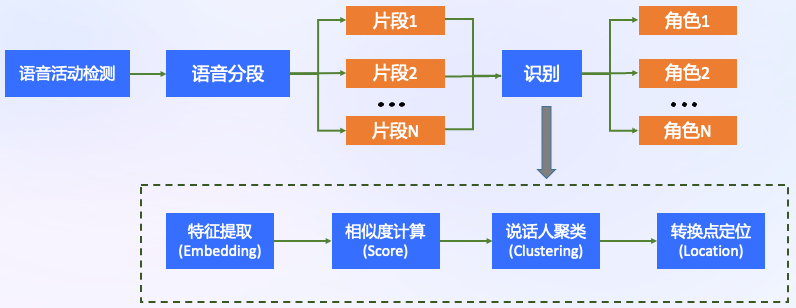

---
tasks:
- auto-speech-recognition
domain:
- audio
model-type:
- Non-autoregressive
frameworks:
- pytorch
backbone:
- transformer/conformer
metrics:
- CER
license: Apache License 2.0
language: 
- cn
tags:
- FunASR
- Paraformer
- Alibaba
- Speaker
datasets:
  train:
  - 60,000 hour industrial Mandarin task
  test:
  - AISHELL-1 dev/test
  - AISHELL-2 dev_android/dev_ios/dev_mic/test_android/test_ios/test_mic
  - WentSpeech dev/test_meeting/test_net
  - SpeechIO TIOBE
  - 60,000 hour industrial Mandarin task
indexing:
   results:
   - task:
       name: Automatic Speech Recognition
     dataset:
       name: 60,000 hour industrial Mandarin task
       type: audio    # optional
       args: 16k sampling rate, 8404 characters  # optional
     metrics:
       - type: CER
         value: 8.53%  # float
         description: greedy search, withou lm, avg.
         args: default
       - type: RTF
         value: 0.0251  # float
         description: GPU inference on V100
         args: batch_size=1
widgets:
  - task: auto-speech-recognition
    model_revision: v1.2.1
    inputs:
      - type: audio
        name: input
        title: 音频
    examples:
      - name: 1
        title: 示例1
        inputs:
          - name: input
            data: git://example/asr_example.wav
    inferencespec:
      cpu: 8 #CPU数量
      memory: 4096
finetune-support: True
---


# Highlights

- Paraformer-large长音频说话人模型在普通长音频版基础上集成了CAM++说话人聚类分类功能，返回的结果中添加了句子级别的说话人分类结果。
  - [Paraformer-large长音频模型](https://modelscope.cn/models/damo/speech_paraformer-large-vad-punc_asr_nat-zh-cn-16k-common-vocab8404-pytorch/summary)
  - [CAM++模型](https://modelscope.cn/models/damo/speech_campplus_speaker-diarization_common/summary)


## <strong>[ModelScope-FunASR](https://github.com/alibaba-damo-academy/FunASR)</strong>
<strong>[FunASR](https://github.com/alibaba-damo-academy/FunASR)</strong>希望在语音识别方面建立学术研究和工业应用之间的桥梁。通过支持在ModelScope上发布的工业级语音识别模型的训练和微调，研究人员和开发人员可以更方便地进行语音识别模型的研究和生产，并促进语音识别生态系统的发展。

[**最新动态**](https://github.com/alibaba-damo-academy/FunASR#whats-new) 
| [**环境安装**](https://github.com/alibaba-damo-academy/FunASR#installation)
| [**介绍文档**](https://alibaba-damo-academy.github.io/FunASR/en/index.html)
| [**中文教程**](https://github.com/alibaba-damo-academy/FunASR/wiki#funasr%E7%94%A8%E6%88%B7%E6%89%8B%E5%86%8C)
| [**服务部署**](https://github.com/alibaba-damo-academy/FunASR/tree/main/funasr/runtime)
| [**模型库**](https://github.com/alibaba-damo-academy/FunASR/blob/main/docs/model_zoo/modelscope_models.md)
| [**联系我们**](https://github.com/alibaba-damo-academy/FunASR#contact)


## 项目介绍

Paraformer是达摩院语音团队提出的一种高效的非自回归端到端语音识别框架。本项目应用户的要求在Paraformer-长音频版识别中集成了达摩院自研的CAM++系列说话人聚类与分类模型，结合长音频版的VAD、时间戳与标点预测功能，能够为识别结果中的每一个子句进行准确的说话人分类。

<p align="center">


Paraformer模型结构如上图所示，由 Encoder、Predictor、Sampler、Decoder 与 Loss function 五部分组成。

<p align="center">


本项目中集成的说话人技术是达摩院最新的自研说话人技术。包括基于FSMN-VAD的语音活动端点检测模型、CAM++说话人识别模型和结合谱图和基于流行拓扑降维的聚类算法。
其中CAM++是兼具准确识别和高效计算的说话人识别模型，其通过多种类型池化操作提取不同尺度的上下文信息，生成的上下文相关掩蔽（Context-aware Mask，CAM）模块可以提取关键的说话人信息。实验表明CAM++相比于主流的说话人模型ECAPA-TDNN和ResNet34有着更高的准确率和更快推理速度。

另外聚类算法对于确定说话人人数至关重要。谱聚类（Spectral clustering）是一种基于图概念的聚类算法，被广泛用于说话人日志领域，在说话人数较少的短音频下表现突出。基于流行拓扑降维的聚类（UMAP-HDBSCAN）可以将说话人特征降维到区分度最大的低维空间中，过滤掉冗余信息的干扰，更适合人数较多的长音频场景。本模型结合这两种聚类方法在不同场景下可以更加精准地别说话人的特征分布。


其核心点主要有：  
- CAM++相关speaker模块：更精确的聚类分类，更高的准确率和更快的推理速度。
- Predictor 模块：基于 Continuous integrate-and-fire (CIF) 的 预测器 (Predictor) 来抽取目标文字对应的声学特征向量，可以更加准确的预测语音中目标文字个数。  
- Sampler：通过采样，将声学特征向量与目标文字向量变换成含有语义信息的特征向量，配合双向的 Decoder 来增强模型对于上下文的建模能力。  


更详细的细节见：
- 论文： [Paraformer: Fast and Accurate Parallel Transformer for Non-autoregressive End-to-End Speech Recognition](https://arxiv.org/abs/2206.08317)
- 论文解读：[Paraformer: 高识别率、高计算效率的单轮非自回归端到端语音识别模型](https://mp.weixin.qq.com/s/xQ87isj5_wxWiQs4qUXtVw)
- 论文： [CAM++: A Fast and Efficient Network for Speaker Verification Using Context-Aware Masking](https://arxiv.org/abs/2303.00332)
- 论文解读：[达摩院开源工业级说话人识别模型CAM++](https://mp.weixin.qq.com/s/B_A1eudNJbMv72D17nk6KQ)


## 如何使用与训练自己的模型

本项目提供的预训练模型是基于大数据训练的通用领域识别模型，开发者可以基于此模型进一步利用ModelScope的微调功能或者本项目对应的Github代码仓库[FunASR](https://github.com/alibaba-damo-academy/FunASR)进一步进行模型的领域定制化。

### 在Notebook中开发

对于有开发需求的使用者，特别推荐您使用Notebook进行离线处理。先登录ModelScope账号，点击模型页面右上角的“在Notebook中打开”按钮出现对话框，首次使用会提示您关联阿里云账号，按提示操作即可。关联账号后可进入选择启动实例界面，选择计算资源，建立实例，待实例创建完成后进入开发环境，进行调用。

#### 基于ModelScope进行推理

- 推理支持音频格式如下：
  - wav文件路径，例如：data/test/audios/asr_example.wav
  - pcm文件路径，例如：data/test/audios/asr_example.pcm
  - wav文件url，例如：https://isv-data.oss-cn-hangzhou.aliyuncs.com/ics/MaaS/ASR/test_audio/asr_example_zh.wav
  - wav二进制数据，格式bytes，例如：用户直接从文件里读出bytes数据或者是麦克风录出bytes数据。
  - 已解析的audio音频，例如：audio, rate = soundfile.read("asr_example_zh.wav")，类型为numpy.ndarray或者torch.Tensor。
  - wav.scp文件，需符合如下要求：

```sh
cat wav.scp
asr_example1  data/test/audios/asr_example1.wav
asr_example2  data/test/audios/asr_example2.wav
...
```

- 若输入格式wav文件url，api调用方式可参考如下范例：

```python
from modelscope.pipelines import pipeline
from modelscope.utils.constant import Tasks

if __name__ == '__main__':
    audio_in = 'https://isv-data.oss-cn-hangzhou.aliyuncs.com/ics/MaaS/ASR/test_audio/asr_speaker_demo.wav'
    output_dir = "./results"
    inference_pipeline = pipeline(
        task=Tasks.auto_speech_recognition,
        model='damo/speech_paraformer-large-vad-punc-spk_asr_nat-zh-cn',
        model_revision='v0.0.2',
        vad_model='damo/speech_fsmn_vad_zh-cn-16k-common-pytorch',
        punc_model='damo/punc_ct-transformer_cn-en-common-vocab471067-large',
        output_dir=output_dir,
    )
    rec_result = inference_pipeline(audio_in=audio_in, batch_size_token=5000, batch_size_token_threshold_s=40, max_single_segment_time=6000)
    print(rec_result)
```

- 输入音频为wav格式，api调用方式可参考如下范例:

```python
rec_result = inference_pipeline(audio_in='asr_speaker_demo.wav')
```

- 若输入格式为文件wav.scp(注：文件名需要以.scp结尾)，可添加 output_dir 参数将识别结果写入文件中，api调用方式可参考如下范例:

```python
inference_pipeline(audio_in="wav.scp")
```
识别结果输出路径结构如下：

```sh
tree output_dir/
output_dir/
└── 1best_recog
    ├── rtf
    ├── score
    ├── text
    └── time_stamp

1 directory, 4 files
```


### 在本地机器中开发

#### 基于ModelScope进行微调和推理

支持基于ModelScope上数据集及私有数据集进行定制微调和推理，使用方式同Notebook中开发。

#### 基于FunASR进行微调和推理

FunASR框架支持魔搭社区开源的工业级的语音识别模型的training & finetuning，使得研究人员和开发者可以更加便捷的进行语音识别模型的研究和生产，目前已在Github开源：https://github.com/alibaba-damo-academy/FunASR 。若在使用过程中遇到任何问题，欢迎联系我们：[联系方式](https://github.com/alibaba-damo-academy/FunASR/blob/main/docs/images/dingding.jpg)

#### FunASR框架安装

- 安装FunASR和ModelScope，[详见](https://github.com/alibaba-damo-academy/FunASR/wiki)

```sh
pip3 install -U modelscope
git clone https://github.com/alibaba/FunASR.git && cd FunASR
pip3 install -e ./
```


#### 基于FunASR进行推理

接下来会以私有数据集为例，介绍如何在FunASR框架中使用Paraformer-large进行推理以及微调。

```sh
cd egs_modelscope/asr_vad_spk/speech_paraformer-large-vad-punc-spk_asr_nat-zh-cn
python infer.py
```

#### 基于FunASR进行微调
```sh
cd egs_modelscope/asr_vad_spk/speech_paraformer-large-vad-punc-spk_asr_nat-zh-cn
python finetune.py
```

多卡进行微调训练用法与notebook中相同。

## Benchmark
  结合大数据、大模型优化的Paraformer在一序列语音识别的benchmark上获得当前SOTA的效果，以下展示学术数据集AISHELL-1、AISHELL-2、WenetSpeech，公开评测项目SpeechIO TIOBE白盒测试场景的效果。在学术界常用的中文语音识别评测任务中，其表现远远超于目前公开发表论文中的结果，远好于单独封闭数据集上的模型。此结果为[Paraformer-large模型](https://www.modelscope.cn/models/damo/speech_paraformer-large_asr_nat-zh-cn-16k-aishell1-vocab8404-pytorch/summary)在无VAD和标点模型下的测试结果。

### AISHELL-1

| AISHELL-1 test                                   | w/o LM                                | w/ LM                                 |
|:------------------------------------------------:|:-------------------------------------:|:-------------------------------------:|
| <div style="width: 150pt">Espnet</div>           | <div style="width: 150pt">4.90</div>  | <div style="width: 150pt">4.70</div>  | 
| <div style="width: 150pt">Wenet</div>            | <div style="width: 150pt">4.61</div>  | <div style="width: 150pt">4.36</div>  | 
| <div style="width: 150pt">K2</div>               | <div style="width: 150pt">-</div>     | <div style="width: 150pt">4.26</div>  | 
| <div style="width: 150pt">Blockformer</div>      | <div style="width: 150pt">4.29</div>  | <div style="width: 150pt">4.05</div>  |
| <div style="width: 150pt">Paraformer-large</div> | <div style="width: 150pt">1.95</div>  | <div style="width: 150pt">1.68</div>     | 

### AISHELL-2

|           | dev_ios| test_android| test_ios|test_mic|
|:-------------------------------------------------:|:-------------------------------------:|:-------------------------------------:|:------------------------------------:|:------------------------------------:|
| <div style="width: 150pt">Espnet</div>            | <div style="width: 70pt">5.40</div>  |<div style="width: 70pt">6.10</div>  |<div style="width: 70pt">5.70</div>  |<div style="width: 70pt">6.10</div>  |
| <div style="width: 150pt">WeNet</div>             | <div style="width: 70pt">-</div>     |<div style="width: 70pt">-</div>     |<div style="width: 70pt">5.39</div>  |<div style="width: 70pt">-</div>    |
| <div style="width: 150pt">Paraformer-large</div>  | <div style="width: 70pt">2.80</div>  |<div style="width: 70pt">3.13</div>  |<div style="width: 70pt">2.85</div>  |<div style="width: 70pt">3.06</div>  |


### Wenetspeech

|           | dev| test_meeting| test_net|
|:-------------------------------------------------:|:-------------------------------------:|:-------------------------------------:|:------------------------------------:|
| <div style="width: 150pt">Espnet</div>            | <div style="width: 100pt">9.70</div>  |<div style="width: 100pt">15.90</div>  |<div style="width: 100pt">8.80</div>  |
| <div style="width: 150pt">WeNet</div>             | <div style="width: 100pt">8.60</div>  |<div style="width: 100pt">17.34</div>  |<div style="width: 100pt">9.26</div>  |
| <div style="width: 150pt">K2</div>                | <div style="width: 100pt">7.76</div>  |<div style="width: 100pt">13.41</div>  |<div style="width: 100pt">8.71</div>  |
| <div style="width: 150pt">Paraformer-large</div>  | <div style="width: 100pt">3.57</div>  |<div style="width: 100pt">6.97</div>   |<div style="width: 100pt">6.74</div>  |

### [SpeechIO TIOBE](https://github.com/SpeechColab/Leaderboard)

Paraformer-large模型结合Transformer-LM模型做shallow fusion，在公开评测项目SpeechIO TIOBE白盒测试场景上获得当前SOTA的效果，目前[Transformer-LM模型](https://modelscope.cn/models/damo/speech_transformer_lm_zh-cn-common-vocab8404-pytorch/summary)已在ModelScope上开源，以下展示SpeechIO TIOBE白盒测试场景without LM、with Transformer-LM的效果：

- Decode config w/o LM: 
  - Decode without LM
  - Beam size: 1
- Decode config w/ LM:
  - Decode with [Transformer-LM](https://modelscope.cn/models/damo/speech_transformer_lm_zh-cn-common-vocab8404-pytorch/summary)
  - Beam size: 10
  - LM weight: 0.15

| testset | w/o LM | w/ LM |
|:------------------:|:----:|:----:|
|<div style="width: 200pt">SPEECHIO_ASR_ZH00001</div>| <div style="width: 150pt">0.49</div> | <div style="width: 150pt">0.35</div> |
|<div style="width: 200pt">SPEECHIO_ASR_ZH00002</div>| <div style="width: 150pt">3.23</div> | <div style="width: 150pt">2.86</div> |
|<div style="width: 200pt">SPEECHIO_ASR_ZH00003</div>| <div style="width: 150pt">1.13</div> | <div style="width: 150pt">0.80</div> |
|<div style="width: 200pt">SPEECHIO_ASR_ZH00004</div>| <div style="width: 150pt">1.33</div> | <div style="width: 150pt">1.10</div> |
|<div style="width: 200pt">SPEECHIO_ASR_ZH00005</div>| <div style="width: 150pt">1.41</div> | <div style="width: 150pt">1.18</div> |
|<div style="width: 200pt">SPEECHIO_ASR_ZH00006</div>| <div style="width: 150pt">5.25</div> | <div style="width: 150pt">4.85</div> |
|<div style="width: 200pt">SPEECHIO_ASR_ZH00007</div>| <div style="width: 150pt">5.51</div> | <div style="width: 150pt">4.97</div> |
|<div style="width: 200pt">SPEECHIO_ASR_ZH00008</div>| <div style="width: 150pt">3.69</div> | <div style="width: 150pt">3.18</div> |
|<div style="width: 200pt">SPEECHIO_ASR_ZH00009</div>| <div style="width: 150pt">3.02</div> | <div style="width: 150pt">2.78</div> |
|<div style="width: 200pt">SPEECHIO_ASR_ZH000010</div>| <div style="width: 150pt">3.35</div> | <div style="width: 150pt">2.99</div> |
|<div style="width: 200pt">SPEECHIO_ASR_ZH000011</div>| <div style="width: 150pt">1.54</div> | <div style="width: 150pt">1.25</div> |
|<div style="width: 200pt">SPEECHIO_ASR_ZH000012</div>| <div style="width: 150pt">2.06</div> | <div style="width: 150pt">1.68</div> |
|<div style="width: 200pt">SPEECHIO_ASR_ZH000013</div>| <div style="width: 150pt">2.57</div> | <div style="width: 150pt">2.25</div> |
|<div style="width: 200pt">SPEECHIO_ASR_ZH000014</div>| <div style="width: 150pt">3.86</div> | <div style="width: 150pt">3.08</div> |
|<div style="width: 200pt">SPEECHIO_ASR_ZH000015</div>| <div style="width: 150pt">3.34</div> | <div style="width: 150pt">2.67</div> |


## 使用方式以及适用范围

运行范围
- 支持Linux-x86_64、Mac和Windows运行。

使用方式
- 直接推理：可以直接对输入音频进行解码，输出目标文字。
- 微调：加载训练好的模型，采用私有或者开源数据进行模型训练。

使用范围与目标场景
- 适合与离线语音识别场景，如录音文件转写，配合GPU推理效果更加，输入音频时长不限制，可以为几个小时音频。


## 模型局限性以及可能的偏差

考虑到特征提取流程和工具以及训练工具差异，会对CER的数据带来一定的差异（<0.1%），推理GPU环境差异导致的RTF数值差异。


## 相关论文以及引用信息

```BibTeX
@inproceedings{gao2022paraformer,
  title={Paraformer: Fast and Accurate Parallel Transformer for Non-autoregressive End-to-End Speech Recognition},
  author={Gao, Zhifu and Zhang, Shiliang and McLoughlin, Ian and Yan, Zhijie},
  booktitle={INTERSPEECH},
  year={2022}
}
```
